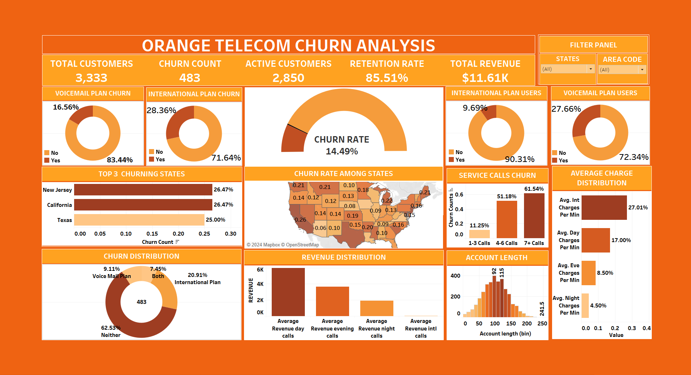

# Telecom Churn Dashboard

## 🔍 Project Highlights

- **Data Wrangling**: Preprocessed the telecom dataset to ensure clean and accurate data for visualization.
- **Interactive Dashboards**: Designed a user-friendly dashboard that allows stakeholders to explore churn metrics dynamically.
- **Insightful Visuals**: Created visualizations to highlight key churn factors, trends, and customer segments at risk.

## ScreenShot

## Tools used
- **Tableau**

## 📈 Key Insights

- Out of **3,333** customers, the churn rate is approximately **14.49%**, indicating potential issues in customer retention.
- **Voice Mail Plan**: Higher churn among customers without the plan; providing it could reduce churn.
- **International Plan**: Higher churn among customers without the plan; offering it could help retain customers. Lower adoption of the International plan could be due to high charges, contributing to higher churn rates among its subscribers.
- **Bundled Services**: Lowest churn rates among customers with both plans, showcasing the effectiveness of bundled services.
- **Regional Trends**: High churn rates in **New Jersey, California, and Texas**; low churn rates in **Hawaii, Alaska, and Arizona**, indicating regional satisfaction variations.
- **Average Charges**: Highest charges per minute for international calls, indicating significant revenue.
- **Customer Service Calls**: Lower churn (10-13%) with 0-3 service calls; over **45%** churn with 4-9 service calls, highlighting service call impacts.

## 💡 Insights and Recommendations

These insights highlight the need for targeted strategies to enhance customer retention and reduce churn, focusing on service plans, regional trends, and customer service interactions.

## How to Use the Dashboard

1. **Open Tableau**: Load the workbook file into Tableau.
2. **Interact with the Dashboard**: Use filters and interactive elements to explore the data.
3. **Analyze Insights**: Review visualizations and derive insights for decision-making.

[Dashboard Link](https://public.tableau.com/app/profile/mansi.gupta5179/viz/OrangeTelecomChurnDashboard/Dashboard4)

